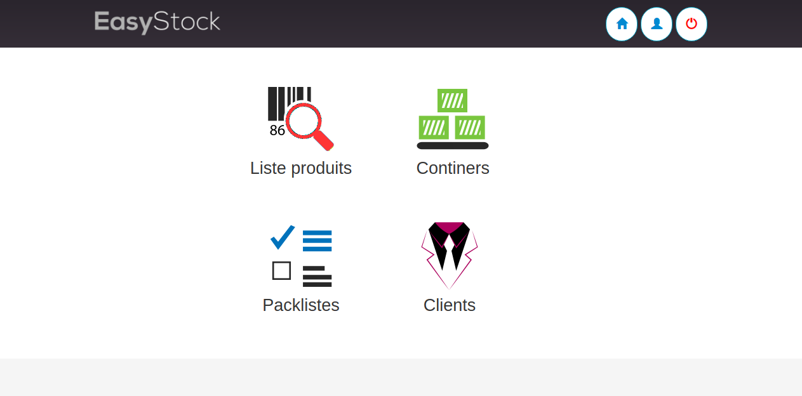

# Texstock

Texstock is a tracking and management application in the field of used textile.

TexStock has several levels of use:  
* Admin
    - Add,Edit,Delete a user
    - Add,Edit,Delete a command
    - Add,Edit,Delete a product
    - Add,Edit,Delete a product's quality
    - Add,Edit,Delete a costumer
    - Monitoring the production
* Operator
    - Print labels
    - Read command's product
* Scanner
    - Look for products
    - Scan a product 
    - Add a product for a command 
 
To test:  [Click here](http://texstock.cloud/projet/11/homepage.php)  
**Admin**  
User: admin  
password : admin  
**Scan**  
user: scan  
password : scan  
**Operator**  
user: operator  
password : operator  

Technology used:
- HTML/CSS
- Boostrap
- Javascript/jquery/AJAX
- [sweetalert JS](https://sweetalert.js.org)
- PHP / composer
- Mysql
